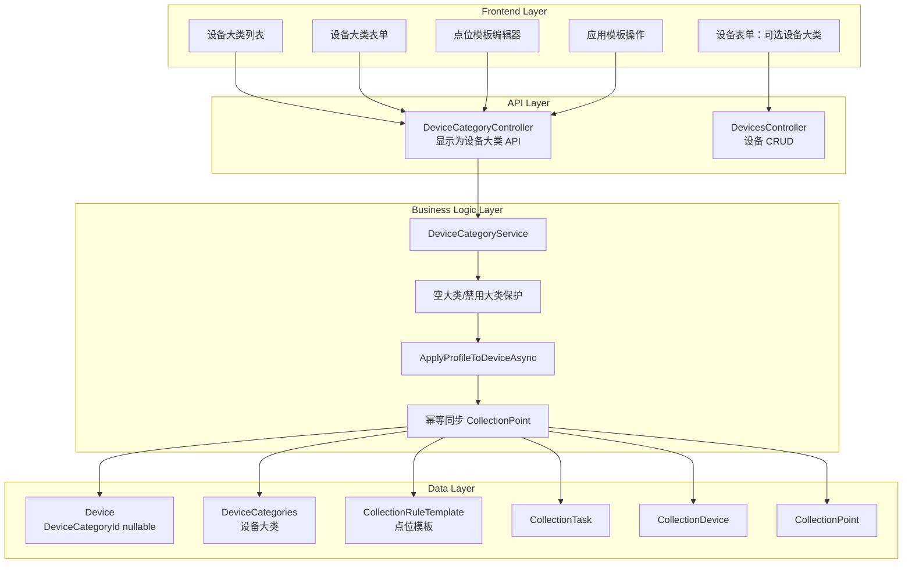
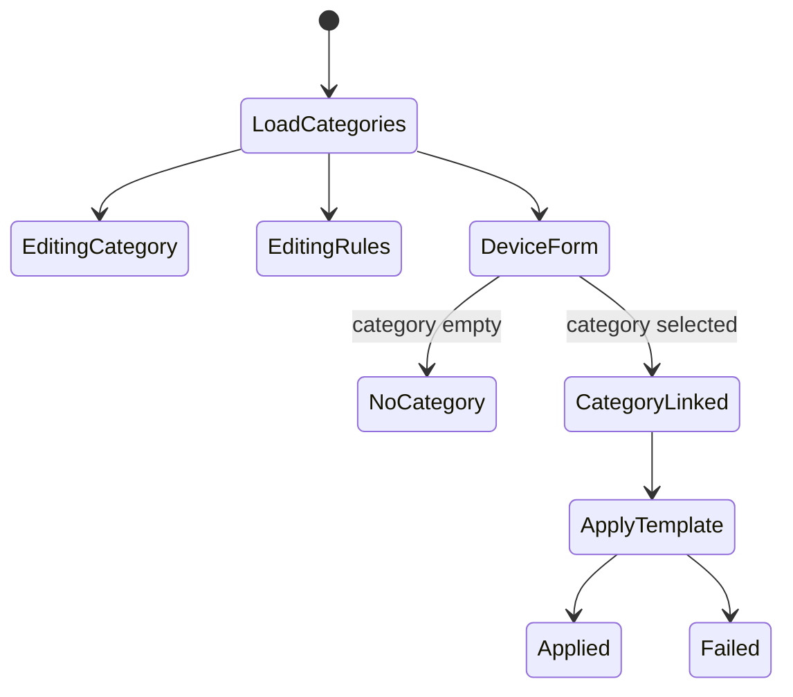

# Implementation Plan：设备大类与点位模板应用

> 对应 PRD：[设备大类与点位模板应用 PRD](./prd.md)
> 状态：**收敛实施范围：移除公开设备角色字段，设备大类表按 DeviceCategories 设计**

## 1. Goal

本功能将历史点位模板概念收敛为“设备大类”，用于同类物理设备的点位模板复用。公开模型中直接移除普通设备/网关角色字段，不再把普通设备/网关作为设备属性暴露。若 EF 继承映射仍需区分 `Device` / `Gateway`，仅使用内部 shadow discriminator（当前为 `DeviceRole`），业务代码通过 `device is Gateway` 或 `_context.Gateway` 判断。设备大类关联是可选的，未关联设备大类的设备不得触发模板应用、采集任务生成或其它大类逻辑。

## 2. Requirements

- 删除旧公开设备角色字段、`Produce` 默认设备角色字段、相关 DTO 字段、枚举和前端表单项。
- EF 继承映射改用内部 `DeviceRole` shadow discriminator，不能暴露到业务 API。
- 将用户可见概念统一为“设备大类”。
- 数据库表使用 `DeviceCategories`，代码层使用 `DeviceCategory` 实体、服务、控制器和 DTO 命名。
- 复用 `CollectionRuleTemplate` 作为设备大类下的点位模板。
- 允许 `Device.DeviceCategoryId` 为空。
- 当设备未显式选择或应用设备大类时，不得自动创建采集任务和点位。
- 当设备大类禁用时，`ApplyProfile` 必须返回错误。
- 模板应用必须幂等：按 `PointKey` 更新已有点位，新增缺失点位，不重复创建。
- 模板应用必须在事务中完成。
- API 返回结构遵守 `ApiResult<PagedData<T>>`，失败返回空分页对象。
- 前端页面使用 Element Plus 显式组件，不使用 fast-crud。

## 3. Technical Considerations

### 3.1 System Architecture Overview



### 3.2 Technology Stack Selection

- 后端：ASP.NET Core Controller + EF Core，沿用仓库现有模式。
- 数据模型：数据库表收敛为 `DeviceCategories` + `CollectionRuleTemplate`；服务类名可先复用 `DeviceCategoryService`，后续单独重命名。
- 前端：Vue 3 + Element Plus 显式表格、表单、抽屉或弹窗。
- 测试：沿用 `IoTSharp.Test` 的 xUnit 风格，补服务层和 API 合同测试。

### 3.3 Integration Points

- `DevicesController`：设备新增/编辑时允许 `DeviceCategoryId` 为空或设置为某个设备大类。
- `DeviceCategoryController`：保留现有路由，前端文案显示为设备大类。
- `DeviceCategoryService.ApplyProfileToDeviceAsync`：加入空关联、禁用大类和事务保护。
- `CollectionTaskService` / 采集运行时：不直接改运行时，只确保生成的任务和点位符合现有结构。

### 3.4 Deployment Architecture

无需新增服务或容器。若修改 DTO、枚举、公共接口签名，必须按项目约定执行停止进程、`dotnet clean`、全量 `dotnet build`、重新启动。

### 3.5 Scalability Considerations

第一阶段按单体单实例设计。模板应用是低频配置操作，不进入高并发路径。需要通过数据库索引保证按 `ProfileId` 查询点位模板、按 `DeviceId/PointKey` 查找点位的效率。

## 4. Database Schema Design

### 4.1 ER Diagram

```mermaid
erDiagram
    Device {
        guid Id
        string Name
        guid DeviceCategoryId nullable
    }

    DeviceCategory {
        guid Id
        string ProfileKey
        string ProfileName
        enum HvacCategory
        bool Enabled
        int Version
    }

    CollectionRuleTemplate {
        guid Id
        guid ProfileId
        string PointKey
        string PointName
        byte FunctionCode
        ushort Address
        ushort RegisterCount
        string RawDataType
        string TargetName
        string TargetType
    }

    CollectionTask {
        guid Id
        string TaskKey
        guid GatewayDeviceId
    }

    CollectionDevice {
        guid Id
        guid TaskId
        string DeviceKey
    }

    CollectionPoint {
        guid Id
        guid DeviceId
        string PointKey
        guid TargetDeviceId
    }

    DeviceCategory ||--o{ CollectionRuleTemplate : contains
    DeviceCategory ||--o{ Device : optional_category
    CollectionTask ||--o{ CollectionDevice : contains
    CollectionDevice ||--o{ CollectionPoint : contains
```

### 4.2 Table Specifications

- `Device.DeviceCategoryId`：可空，表示设备是否关联设备大类。
- `DeviceCategories`：设备大类表，承载大类基础信息和点位模板入口。
- `DeviceCategories.HvacCategory`：暖通业务大类枚举，不是普通设备/网关角色。
- `CollectionRuleTemplates.ProfileId`：关联设备大类。
- `CollectionPoints.PointKey`：用于模板应用幂等同步。

### 4.3 Indexing Strategy

- 确认 `DeviceCategories.ProfileKey` 有唯一索引。
- 确认 `DeviceCategories.HvacCategory` 和 `DeviceCategories.Enabled` 有查询索引。
- 确认 `CollectionRuleTemplates.ProfileId` 有索引。
- 建议增加或确认 `CollectionPoints.DeviceId + PointKey` 的查询效率；若现有模型不支持唯一约束，先在服务层防重复。

### 4.4 Migration Strategy

迁移需要执行：

- 新增内部 `DeviceRole` 判别列，并从旧设备角色列数据迁移 `0 -> Device`、`1 -> Gateway`。
- 删除旧设备角色列和 `Produce` 默认设备角色列。
- 将设备大类表统一为 `DeviceCategories`。
- 将设备大类的暖通业务分类列统一为 `HvacCategory`。
- 保留 `Device.DeviceCategoryId` 可空外键列。

## 5. API Design

### 5.1 设备大类列表

- Method: `GET`
- Route: `api/DeviceCategory/GetAll`
- Response: `ApiResult<PagedData<DeviceCategoryDto>>`
- 说明：复用现有 Controller，前端展示为设备大类。

### 5.2 设备大类详情

- Method: `GET`
- Route: `api/DeviceCategory/Get/{id}`
- Response: `ApiResult<PagedData<DeviceCategoryDto>>`
- 要求：若不存在，返回 `{ total: 0, rows: [] }`。

### 5.3 创建设备大类

- Method: `POST`
- Route: `api/DeviceCategory/Create`
- Request: `CreateDeviceCategoryDto`
- Response: `ApiResult<PagedData<DeviceCategoryDto>>`

### 5.4 维护点位模板

- Routes: 复用 `GetRules`、`AddRule`、`UpdateRule`、`DeleteRule`
- Response: `ApiResult<PagedData<CollectionRuleTemplateDto>>`
- 要求：失败场景返回空分页对象。

### 5.5 设备关联设备大类

- 可在设备新增/编辑 DTO 中增加或确认 `DeviceCategoryId`。
- 未传时保存为空，不触发模板应用。

### 5.6 应用模板

- Method: `POST`
- Route: `api/DeviceCategory/ApplyProfile`
- Request:

```ts
interface ApplyDeviceCategoryDto {
  deviceId: string;
  profileId?: string;
}
```

- 行为：
  - `profileId` 为空时，从设备当前 `DeviceCategoryId` 读取。
  - 两者都为空时返回错误，且不创建任何记录。
  - 设备大类禁用时返回错误。
  - 成功时返回应用结果分页对象。

## 6. Frontend Architecture

### 6.1 Component Hierarchy

```text
设备大类页面
├── 查询区
│   ├── 名称输入
│   ├── 启用状态选择
│   └── 查询/重置按钮
├── 操作区
│   ├── 新增设备大类
│   └── 刷新
├── 设备大类表格
│   ├── 大类名称
│   ├── 暖通分类
│   ├── 启用状态
│   ├── 点位数量
│   └── 编辑/点位/删除
├── 设备大类表单抽屉
└── 点位模板编辑抽屉
```

设备表单：

```text
设备新增/编辑
├── 基础信息
├── 接入身份
├── 设备大类（可空）
└── 保存
```

设备详情：

```text
设备详情
├── 基础信息
├── 设备大类状态
└── 应用模板按钮（仅关联设备大类时可用）
```

### 6.2 State Flow



### 6.3 Reusable Components

- `DeviceCategoryTable.vue`
- `DeviceCategoryForm.vue`
- `CollectionRuleTemplateEditor.vue`
- `ApplyDeviceCategoryDialog.vue`

### 6.4 State Management

第一阶段使用组件本地 `ref/reactive` 状态即可。API 封装放在 `ClientApp/src/api/devicecategory/index.ts`，避免直接在组件中拼 URL。

## 7. Security Performance

- 所有设备大类和模板 API 必须 `[Authorize]`。
- 应用模板时必须校验设备属于当前租户/客户。
- 应用模板时必须校验设备大类可用。
- 点位模板输入必须校验功能码、寄存器地址、寄存器数量、轮询周期和 key 格式。
- 模板应用使用事务，避免部分点位写入。
- 未关联设备大类时不查询模板、不生成任务、不写点位，保证无副作用。

## 8. Implementation Steps

1. 后端审查 `DeviceCategory` / `CollectionRuleTemplate` 字段，确认第一阶段无需迁移。
2. 调整 DTO 命名或新增别名 DTO，使 API 语义表现为设备大类。
3. 调整 `DeviceCategoryController` 返回结构，新增/更新/详情统一返回 `PagedData`。
4. 调整设备新增/编辑 DTO 和 Controller，支持 `DeviceCategoryId` 可空保存。
5. 调整 `DeviceCategoryService.ApplyProfileToDeviceAsync`：
   - 空设备大类直接失败。
   - 禁用设备大类直接失败。
   - 使用事务。
   - 按 `PointKey` 幂等同步点位。
6. 前端新增或重做设备大类页面，使用 Element Plus 显式组件。
7. 设备新增/编辑页面增加可空设备大类选择。
8. 设备详情增加应用模板入口，仅在已关联设备大类时可用。
9. 补测试：
   - 未关联设备大类不触发模板。
   - 关联后应用生成点位。
   - 重复应用不重复创建。
   - 禁用设备大类不能应用。
   - 租户/客户越权不能应用。
10. 修改 DTO 或公共接口后执行完整 clean/build。

## 9. Verification

- `dotnet clean`
- `dotnet build`
- 后端测试：`dotnet test IoTSharp.Test/IoTSharp.Test.csproj`
- 前端如修改页面：执行项目现有前端检查命令，若无统一命令则至少启动本地页面验证关键路径。

## 10. Out of Scope

- 不保留公开设备角色字段。
- 不重命名数据库表。
- 不做 Produce 重构。
- 不做边缘 JSON 映射。
- 不做告警/规则/控制模板自动生成。
- 不做模板版本历史和自动级联同步。
