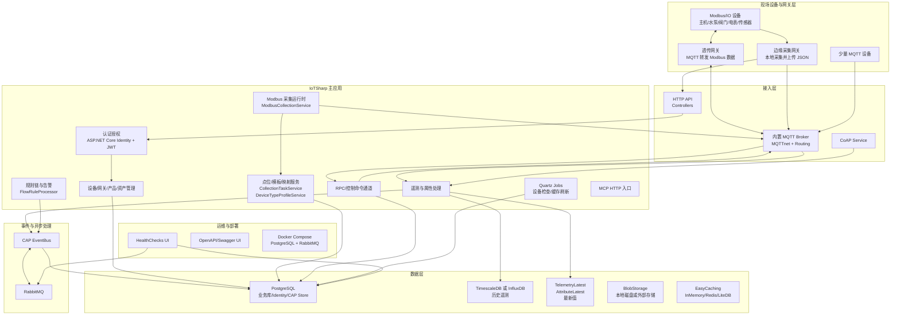
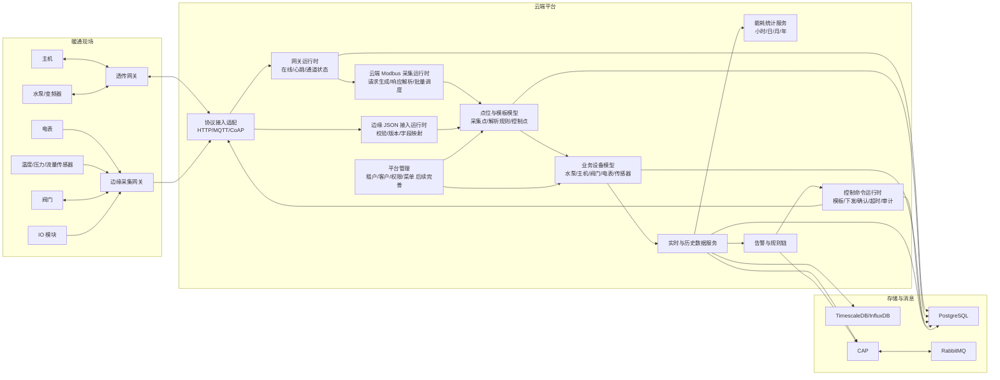
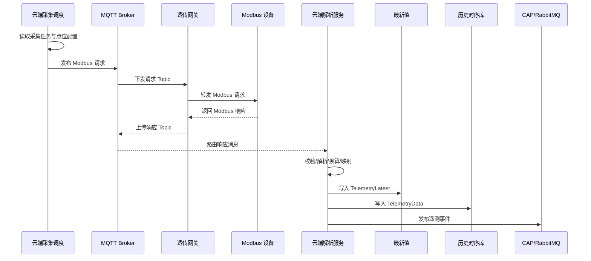
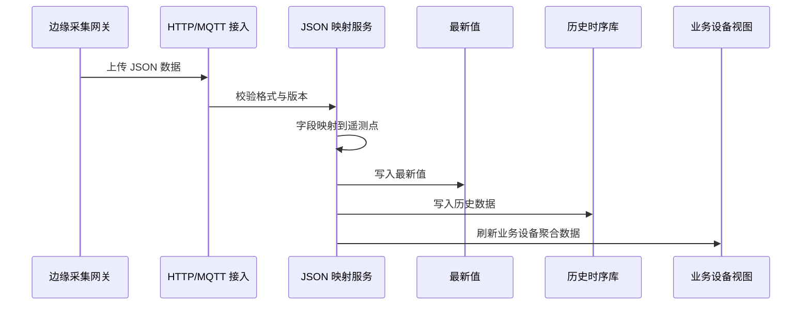

# Epic 架构规格：暖通空调云端物联网平台

## 1. Epic 架构概览

本文档基于长期产品需求文档 `docs/ways-of-work/plan/hvac-cloud-platform/epic.md`，并参考归档旧架构文档 `docs/archive/task/IoTSharp-Architecture.md`，重新描述当前精简后的 IoTSharp fork 架构，以及面向暖通空调云端平台的演进架构。

当前仓库采用单体承载、多模块分层的 ASP.NET Core 架构。`IoTSharp` 主应用同时承载 HTTP API、静态前端入口、内置 MQTT Broker、CoAP 服务、Quartz 定时任务、CAP 事件总线订阅、MCP HTTP 入口和后台采集服务。经过前期精简后，运行时已收敛为 PostgreSQL 关系库、CAP 事件总线、RabbitMQ 消息中间件，以及 TimescaleDB 或 InfluxDB 时序存储。部分历史项目和预留模块仍存在，但不应继续扩大其业务依赖。

长期架构策略是不推翻现有 IoTSharp 投资，在现有设备、产品、遥测、属性、规则、告警、租户和资产模型之上，新增并强化暖通场景需要的“网关接入、Modbus 采集、边缘 JSON 接入、业务设备聚合、控制命令、能耗统计”能力。系统应先完成核心数据与控制闭环，再逐步补齐权限、组态、高级规则和能效分析。

## 2. 系统架构图

### 2.1 当前运行时架构

### 2.2 暖通目标业务架构

### 2.3 核心数据流

## 3. 高层功能与技术使能

### 3.1 高层功能

- **设备与网关管理**：延续 `Device`、`Gateway`、`DeviceIdentity`、`Produce` 等核心模型，强化网关类型、通信状态、下级设备关联和产品模板能力。
- **透传网关采集**：以现有 `ModbusCollectionService`、`CollectionTask`、`CollectionDevice`、`CollectionPoint`、`CollectionLog` 为基础，完善云端 Modbus 请求生成、MQTT 下发、响应接收、解析和日志闭环。
- **边缘 JSON 接入**：在 HTTP/MQTT 接入层增加边缘网关 JSON 数据格式、版本、字段映射和错误诊断机制。
- **点位与模板体系**：继续发展 `DeviceTypeProfile`、`CollectionRuleTemplate`、`ProduceDataMapping` 等模型，形成可复用的设备类型模板、采集点模板和控制点模板。
- **业务设备聚合**：在现有 `Asset`、`AssetRelation`、`Device` 基础上引入暖通业务设备视图，用于表达水泵、主机、阀门、电表、传感器等运维对象。
- **实时与历史数据**：继续使用 `TelemetryLatest`、`AttributeLatest` 表示最新值，使用 `TelemetryData` 和时序存储承载历史数据。
- **控制命令运行时**：复用 MQTT RPC 和现有控制通道，补齐命令模板、命令实例、状态机、超时处理、审计记录和失败反馈。
- **能耗统计**：基于历史遥测数据构建设备级、系统级、站点级电耗统计，后续扩展水耗、冷量、运行时长和效率指标。
- **规则与告警**：保留 `FlowRule`、`Flow`、`FlowOperation`、`Alarm` 和 `FlowRuleProcessor`，后续围绕通信异常、阈值、控制失败和能耗异常做暖通化增强。
- **平台基础能力**：保留身份认证、租户/客户隔离、健康检查、OpenAPI、审计、缓存和部署能力，权限菜单体系后续单独完善。

### 3.2 技术使能

- **运行时收敛**：继续保持当前约束，关系数据库仅支持 PostgreSQL，事件总线仅支持 CAP，消息中间件仅支持 RabbitMQ，时序存储仅支持 TimescaleDB 或 InfluxDB。
- **协议接入边界**：HTTP Controller、MQTT Controller、CoAP Service 只负责接入、认证、基础校验和路由，不承载复杂业务编排。
- **采集运行时边界**：Modbus 采集、JSON 映射、命令执行、能耗统计应独立成服务边界，避免堆积在 Controller。
- **异步事件边界**：遥测入库、告警判断、规则链触发、控制状态变更通过 CAP 事件串联，降低同步请求链路长度。
- **模型边界**：底层通信设备、采集点位、业务设备、能耗统计对象需要分层建模，避免把所有信息塞进 `Device`。
- **可观测性**：采集响应、解析失败、命令超时、网关掉线必须有结构化日志和查询入口。
- **渐进清理**：`IoTSharp.EventBus.NServiceBus`、`IoTSharp.Data.JsonDB` 等非当前运行时主路径的项目暂不扩大依赖，后续按模块评估移除或归档。

## 4. 技术栈

### 4.1 后端与运行时

- .NET 10 / ASP.NET Core
- ASP.NET Core MVC Controllers
- ASP.NET Core Identity + JWT Bearer
- Entity Framework Core
- Quartz.NET
- MQTTnet + MQTTnet.AspNetCore.Routing
- IoTSharp.CoAP.NET
- DotNetCore.CAP
- RabbitMQ
- EasyCaching
- NSwag / OpenAPI
- HealthChecks UI
- Storage.Net
- ModelContextProtocol.AspNetCore

### 4.2 数据与存储

- PostgreSQL：业务库、Identity、CAP Store。
- TimescaleDB 或 InfluxDB：历史遥测时序数据。
- `TelemetryLatest` / `AttributeLatest`：最新遥测与属性数据。
- Redis / LiteDB / InMemory：缓存选项，其中生产环境优先 Redis。
- 本地磁盘或外部 Blob Storage：文件和对象存储。

### 4.3 前端与交付

- `ClientApp`：现有前端应用入口，当前架构文档不展开前端重构。
- Docker Compose：当前开发环境包含 PostgreSQL/TimescaleDB 和 RabbitMQ。
- Linux systemd / Docker：长期部署路径。

### 4.4 当前解决方案模块定位

| 模块 | 当前定位 | 长期策略 |
| --- | --- | --- |
| `IoTSharp` | 主应用，承载 API、MQTT、CoAP、Jobs、规则、采集服务 | 继续作为单体主运行时，逐步梳理内部边界 |
| `IoTSharp.Data` | EF Core 实体、DbContext、配置、分片路由 | 保留并增强暖通核心领域模型 |
| `IoTSharp.Data.TimeSeries` | 时序存储抽象与实现 | 保留，限定 TimescaleDB/InfluxDB |
| `IoTSharp.Data.Storage/IoTSharp.Data.PostgreSQL` | PostgreSQL 数据库支持 | 当前唯一关系数据库运行路径 |
| `IoTSharp.EventBus` | 事件总线抽象 | 保留 |
| `IoTSharp.EventBus.CAP` | CAP + RabbitMQ + PostgreSQL 实现 | 当前唯一事件总线运行路径 |
| `IoTSharp.Contracts` | 枚举、配置、公共契约 | 保留，避免无约束膨胀 |
| `IoTSharp.Dtos` / `IoTSharp/Dtos` | DTO 定义 | 后续应统一边界和命名 |
| `IoTSharp.Interpreter` | 脚本引擎 | 规则链保留，核心暖通概念不依赖纯脚本表达 |
| `IoTSharp.TaskActions` | 规则任务动作 | 保留并按规则链需求清理 |
| `IoTSharp.Extensions.*` | 扩展工具包 | 保留实际运行依赖，清理无用扩展 |
| `IoTSharp.Data.JsonDB` | 历史/测试相关 JSON DB 模块 | 暂不作为主路径，后续评估归档或移除 |
| `IoTSharp.EventBus.NServiceBus` | 历史事件总线实现 | 当前运行时不支持，后续评估归档或移除 |
| `IoTSharp.SDKs` | SDK 示例和客户端 | 保留用于接入验证 |

## 5. 领域边界与模块划分

### 5.1 接入层

职责：

- HTTP API 接入。
- MQTT Broker 与 MQTT Topic 路由。
- CoAP 接入。
- 设备认证、访问令牌、设备密码和后续证书认证。
- 接入消息基础校验和路由。

不应承担：

- 复杂 Modbus 采集编排。
- 业务设备聚合。
- 能耗统计。
- 长时间运行控制流程。

### 5.2 采集层

职责：

- 管理采集任务、采集设备、采集点位和采集日志。
- 针对透传网关生成 Modbus 请求。
- 通过 MQTT 下发采集请求并接收响应。
- 解析 Modbus 响应并映射到平台遥测。
- 对边缘 JSON 数据执行格式校验和字段映射。

现有基础：

- `CollectionTask`
- `CollectionDevice`
- `CollectionPoint`
- `CollectionLog`
- `CollectionTaskService`
- `ModbusCollectionService`
- `ModbusDataParser`
- `CollectionConfigurationLoader`
- `GatewaySchedulerManager`

### 5.3 设备与业务模型层

职责：

- 管理底层设备、网关、产品和设备身份。
- 管理暖通业务设备分类。
- 建立底层数据源与业务设备之间的关系。
- 支持水泵、主机、阀门、电表、传感器等业务视图。

现有基础：

- `Device`
- `Gateway`
- `DeviceIdentity`
- `Produce`
- `Asset`
- `AssetRelation`
- `DeviceTypeProfile`
- `ProduceDataMapping`

### 5.4 数据层

职责：

- 业务配置和主数据存储。
- 最新值存储。
- 历史遥测时序存储。
- 审计日志、命令日志、采集日志和错误上下文。

核心模型：

- `TelemetryLatest`
- `AttributeLatest`
- `TelemetryData`
- `DataStorage`
- `AuditLog`
- `CollectionLog`

### 5.5 控制层

职责：

- 定义控制模板。
- 生成透传网关所需的底层控制数据。
- 生成边缘网关所需的结构化控制命令。
- 管理控制命令状态机。
- 记录审计和失败原因。

目标状态：

- 控制命令不能只是一次 MQTT Publish。
- 控制命令必须有可查询状态、超时处理、权限校验和结果回写。

### 5.6 规则与告警层

职责：

- 基于遥测事件触发规则链。
- 生成通信告警、阈值告警、异常值告警和控制失败告警。
- 后续支持自动化策略，但第一阶段不做复杂闭环控制。

现有基础：

- `FlowRule`
- `Flow`
- `FlowOperation`
- `DeviceRule`
- `Alarm`
- `FlowRuleProcessor`
- `TaskActions`

## 6. 部署架构

### 6.1 开发环境

当前 `docker-compose.yml` 提供：

- `timescale/timescaledb-ha:pg17`，作为 PostgreSQL/TimescaleDB 开发数据库。
- `rabbitmq:4-management-alpine`，作为 CAP 消息中间件。

主应用可在本机通过 `dotnet run` 或 `dotnet watch run` 启动，连接 Docker 中的数据库和 RabbitMQ。

### 6.2 生产建议

第一阶段建议保持单体部署：

- 1 个或多个 IoTSharp 应用实例。
- 独立 PostgreSQL/TimescaleDB。
- 独立 RabbitMQ。
- 可选 Redis。
- 对外暴露 HTTP/HTTPS 与 MQTT 端口。

在多实例部署时需要重点确认：

- 内置 MQTT Broker 的会话和 Topic 路由是否适合横向扩展。
- Modbus 采集调度是否需要分布式锁或单实例调度约束。
- Quartz Job 是否会在多实例重复执行。
- 网关长连接是否需要固定路由或独立接入层。

## 7. 安全与隔离

- 用户认证采用 ASP.NET Core Identity 与 JWT Bearer。
- 多租户隔离依赖 JWT 中的 `TenantId`、`CustomerId` 声明和 `IJustMy` 查询约束。
- 设备认证现有方向包括 AccessToken、DevicePassword 和 X509Certificate。
- 控制命令必须执行用户权限校验、设备归属校验和操作审计。
- 透传网关场景需要防止任意 Modbus 写命令绕过平台模板和安全约束。
- 边缘 JSON 上传需要校验网关身份、Payload 版本、字段白名单和数据范围。

## 8. 技术价值

**技术价值：高。**

该架构在保留当前 IoTSharp fork 可用能力的基础上，重新明确了运行时主路径和后续二次开发边界。它避免继续围绕历史冗余模块扩散依赖，同时把暖通业务最关键的网关、采集、点位、业务设备、控制、能耗和告警能力放到清晰的模块边界中。后续模块 PRD、详细设计和 AI 实施任务可以直接以此文档为技术约束。

## 9. T-Shirt Size 估算

**估算：XL。**

原因：

- 涉及接入、采集、数据、控制、设备建模、统计、告警和平台基础能力多个核心链路。
- 当前仓库已有基础，但功能不完整，且存在历史遗留模块和边界不清问题。
- 透传网关云端 Modbus 采集与控制闭环复杂度较高。
- 暖通业务设备聚合和能耗统计需要新的领域模型，而不只是简单新增 API。

建议按阶段拆分为多个模块级 Epic 或 Feature 实施，第一阶段优先完成“网关接入 + 采集配置 + 遥测入库 + 控制命令 + 基础设备分类”的最小闭环。

## 10. 架构决策与约束

- 不进行完全重写，继续采用渐进式二次开发。
- 当前运行时主路径只支持 PostgreSQL、CAP、RabbitMQ、TimescaleDB/InfluxDB。
- 保留 HTTP、MQTT、CoAP 接入能力，但暖通首期优先 HTTP/MQTT。
- 透传网关的复杂采集和解析主要在云端实现。
- 边缘采集网关以 JSON 数据上传为主，云端负责字段映射和存储。
- 底层通信设备与业务暖通设备必须分离建模。
- API 返回结构继续遵循 `ApiResult<T>`，列表和查询结果统一使用 `{ total, rows }`。
- 修改 DTO、枚举、公共接口签名、Job 构造函数签名后，必须执行完整 clean/build/run 流程，不能只依赖热重载。

## 11. 后续拆分建议

建议按以下模块继续生成模块级 PRD、架构文档和实施计划：

1. 网关与设备接入模块。
2. 透传网关 Modbus 采集模块。
3. 边缘网关 JSON 接入模块。
4. 点位、模板与映射模块。
5. 暖通业务设备建模模块。
6. 控制命令与审计模块。
7. 实时数据与历史数据查询模块。
8. 能耗统计模块。
9. 告警与规则链暖通化模块。
10. 平台权限、菜单与租户管理完善模块。

