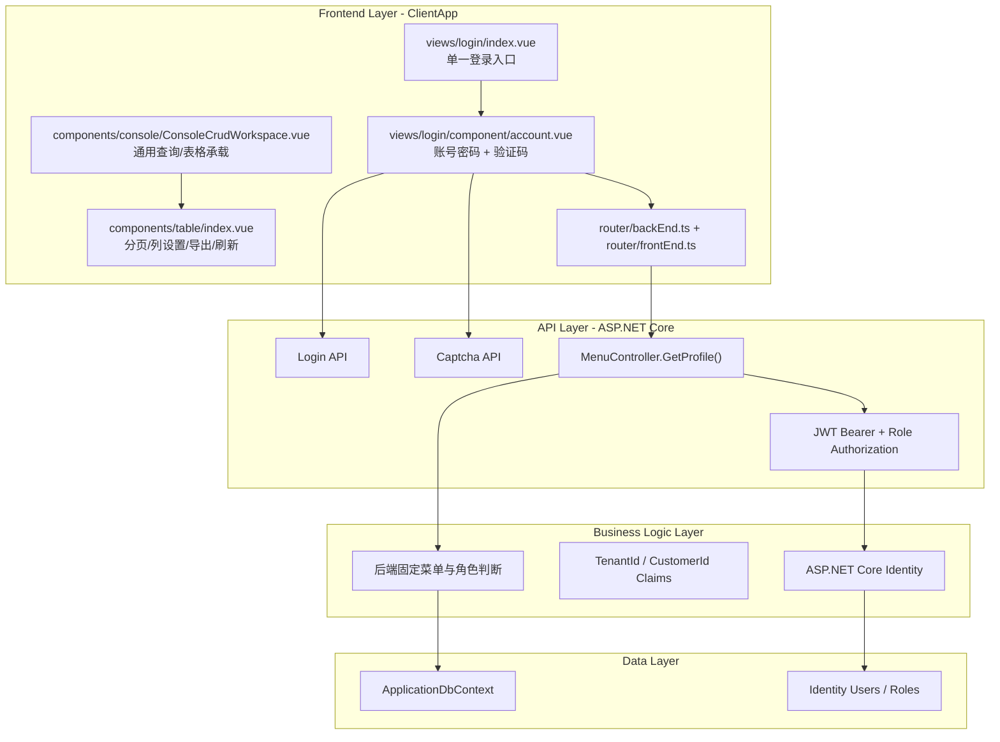
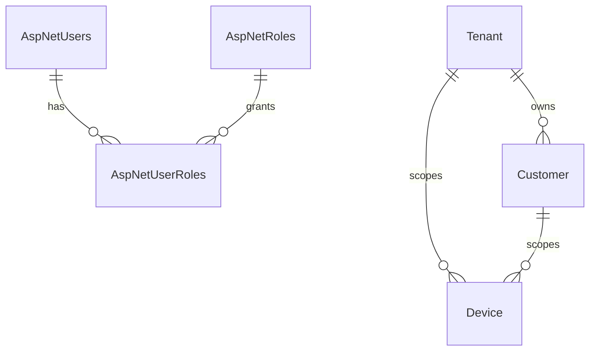
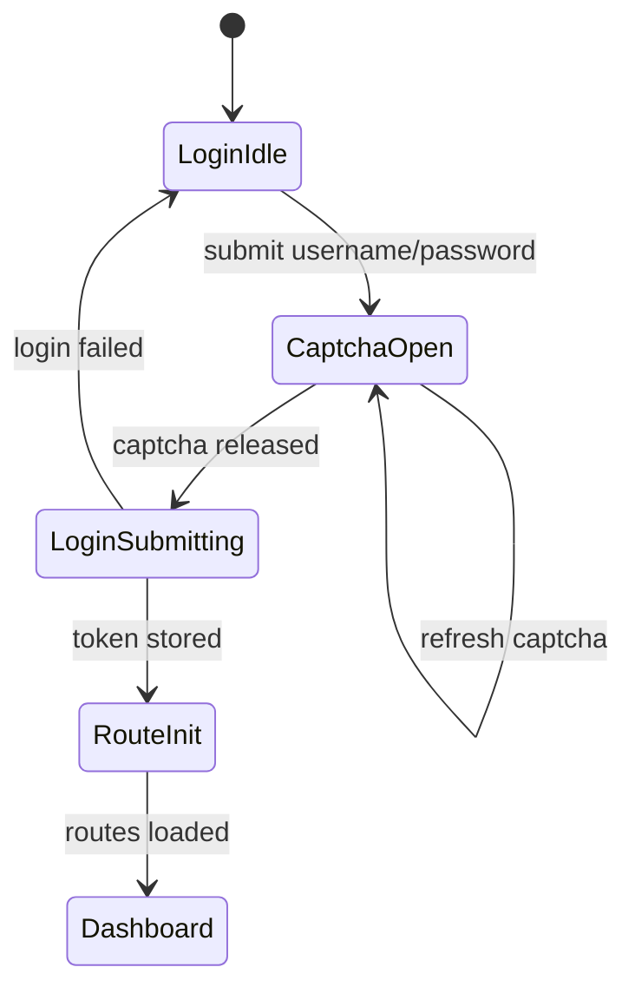

# 实施计划：控制台全局简化与登录入口收敛

## Goal

本计划用于把 `ClientApp` 从偏展示型的控制台视觉，调整为适合 HVAC 云端管理平台的高频运维界面。第一阶段聚焦登录页面，只保留登录入口和必要的安全校验，不在未登录页面展示统计卡片、能力标签或复杂营销信息。后续阶段保留并统一现有查询、操作、表格、分页、表单能力，避免破坏设备、产品、资产、规则链等已有投资。

## Requirements

- 登录页只保留品牌、账号密码入口、验证码弹窗和必要的登录反馈。
- 移除登录页左侧 showcase、统计卡片、能力标签、注册链接和说明型信息块。
- 登录流程继续复用 `useLoginApi()`、`useCaptchaApi()`、`initBackEndControlRoutes()` 和 `initFrontEndControlRoutes()`。
- 保留 `ClientApp/src/components/table/index.vue`、FastCrud 配置、查询表单、分页和操作列能力。
- 保留 `ConsoleCrudWorkspace` 作为后续列表页的统一承载组件。
- 菜单入口以 `IoTSharp/Controllers/MenuController.cs` 为准，前端不另起静态菜单源。
- 后续调整后端菜单时同步维护前端路由路径、组件文件和权限角色。
- 遵循当前 API 返回约定：`ApiResult<T>`，列表数据使用 `{ total, rows }`。

## Technical Considerations

### System Architecture Overview



### Technology Stack Selection

- 前端继续使用 Vue 3、TypeScript、Pinia、Vue Router、Element Plus 与 FastCrud。
- 登录页使用现有 `AppLogo`、Element Plus 表单输入和验证码弹窗，不引入新的 UI 框架。
- 后端菜单继续使用 ASP.NET Core Controller 固定返回，避免前端菜单与角色权限分叉。

### Integration Points

- `ClientApp/src/views/login/index.vue`：页面结构与视觉收敛。
- `ClientApp/src/views/login/component/account.vue`：保留认证逻辑，移除额外说明信息。
- `IoTSharp/Controllers/MenuController.cs`：后续菜单增删改的唯一后端入口。
- `ClientApp/src/router/backEnd.ts`：消费后端菜单并注入动态路由。
- CRUD 页面继续使用现有 API 客户端和统一分页结构。

### Deployment Architecture

- 本阶段仅涉及前端静态资源和可选后端菜单调整。
- 修改 Vue 组件后可通过 `npm run build` 验证前端构建。
- 如果后续修改 DTO、公共接口或后端菜单返回结构，需要停止运行进程、`dotnet clean`、全量 `dotnet build` 后再启动。

### Scalability Considerations

- 登录页保持轻量，降低首屏渲染和维护成本。
- 菜单仍由后端角色控制，便于多租户权限扩展。
- CRUD 能力集中在通用表格、分页、查询表单和 FastCrud 配置，后续设备/资产/产品页面只做领域字段扩展。

## Database Schema Design

本阶段不新增数据库表和字段。



## API Design

- `POST /api/Account/Login` 或现有登录 API：保持现有请求结构，包含用户名、密码、验证码客户端 ID 和滑块位移。
- `GET /api/Captcha/...`：保持现有验证码挑战返回结构。
- `GET /api/Menu/GetProfile`：继续返回后端固定菜单、用户信息和权限函数集合。
- 查询类接口继续返回 `ApiResult<{ total: number; rows: T[] }>`。
- 失败场景保持 `{ code, msg, data: { total: 0, rows: [] } }`，减少前端判空分支。

## Frontend Architecture

### Component Hierarchy Documentation

```text
Login Page
├── AppLogo
├── Header
│   ├── Console Login
│   └── 登录提示
├── Account
│   ├── Username Input
│   ├── Password Input
│   ├── Submit Button
│   └── Captcha Dialog
└── Footer

CRUD/List Pages
├── ConsoleCrudWorkspace
│   ├── Page Action Slot
│   ├── Query Form / Filter Area
│   └── Table or FastCrud Instance
└── Pagination / Operation Column / Table Tools
```

### State Flow Diagram



### Reusable Component Library Specifications

- 登录页只复用 `AppLogo` 和 Element Plus 基础控件。
- 列表页继续复用 `ConsoleCrudWorkspace`、`components/table/index.vue` 和 FastCrud 配置文件。
- 不在登录页复用 dashboard metric/card 组件，避免入口承担数据展示职责。

### State Management Patterns

- 认证令牌继续写入 `Session`。
- 用户名继续写入 Cookie，便于后续会话体验。
- 路由初始化继续根据 `themeConfig.isRequestRoutes` 决定前端或后端路由模式。
- 后端菜单模式下，以 `MenuController.GetProfile()` 返回值作为菜单事实来源。

## Security Performance

- 登录前仍要求账号密码和滑块验证码。
- 不在登录页暴露系统统计、设备数量、协议能力或内部运维指标。
- 首屏组件数量减少，降低未登录页渲染成本。
- 菜单和功能权限仍通过 JWT、角色和后端返回控制。

## Implementation Steps

1. 简化 `ClientApp/src/views/login/index.vue`，移除 showcase 和统计信息。
2. 简化 `ClientApp/src/views/login/component/account.vue`，移除说明卡片和注册链接。
3. 保留验证码弹窗、登录 API、Token 存储和路由初始化逻辑。
4. 检查通用 CRUD/table 组件未被误改。
5. 运行 `npm run build` 验证前端构建。
6. 如后续调整菜单，在 `MenuController.GetProfile()` 中同步角色、路由名、路径和前端组件映射。
