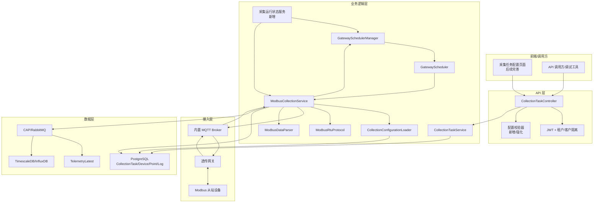

# 实施计划：透传网关 Modbus 采集模块

## Goal

本计划基于同目录 `prd.md`，用于把现有透传网关 Modbus 采集模块从“第一版可运行实现”推进到“可交付、可诊断、可持续扩展”的状态。当前仓库已经具备实体、API、后台服务、调度器、组帧解析和采集日志，不需要推倒重写。实施重点是补齐配置校验、运行诊断、转换规则、调度生命周期、协议文档和测试覆盖。

## Requirements

- 保留现有 `CollectionTask`、`CollectionDevice`、`CollectionPoint`、`CollectionLog` 模型。
- 保留现有 `CollectionTaskController` 和 `CollectionTaskService` 主入口。
- 保留现有 `ModbusCollectionService`、`GatewaySchedulerManager`、`GatewayScheduler`、`ModbusRtuProtocol`、`ModbusDataParser`。
- 补齐采集任务校验，不允许明显错误配置进入运行时。
- 补齐运行状态查询，暴露调度器状态、待响应请求数量、最近错误和最近采集时间。
- 完善 Modbus 数据解析和转换规则，尤其是 `WordOrder` 和多寄存器类型。
- 强化采集日志查询和错误诊断。
- 增加单元测试和必要的服务级测试。
- 遵循统一 API 返回：`ApiResult<T>`，查询结果使用 `{ total, rows }`。

## Technical Considerations

### System Architecture Overview



### Technology Stack Selection

- 后端：继续使用 .NET 10 / ASP.NET Core。
- API：继续使用 MVC Controller，不引入 tRPC 或额外 API 框架。
- 后台任务：继续使用 `BackgroundService` 承载采集运行时。
- MQTT：继续使用 MQTTnet 内置 Broker 和现有 Topic 模型。
- 数据库：继续使用 PostgreSQL 和 EF Core。
- 遥测链路：继续通过 `IPublisher.PublishTelemetryData` 写入现有最新值和历史数据链路。
- 测试：优先使用当前解决方案已有测试项目；若新增测试，放在 `IoTSharp.Test` 或按现有测试约定扩展。

### Integration Points

- `GatewayDeviceId` 必须引用 `DeviceType.Gateway`。
- Modbus 透传网关不使用 `devices/{devname}/telemetry`、`devices/{devname}/attributes` 这类 `MqttRoute` 动态子设备模式。
- Modbus 从站和点位来自 `CollectionTask`、`CollectionDevice`、`CollectionPoint` 配置，不在运行时通过 MQTT Topic 的 `devname` 自动创建。
- `Gateway` 表示平台接入角色，`Protocol = Modbus` 或后续 `GatewayType.Modbus` 表示协议能力；不新增 `DeviceType.ModbusGateway`。
- 采集成功后通过 `IPublisher` 发布遥测，不直接绕过现有数据链路写表。
- MQTT 请求 Topic：`gateway/{gatewayName}/modbus/request/{requestId}`。
- MQTT 响应 Topic：`gateway/{gatewayName}/modbus/response`。
- 第一阶段采用固定 response topic，并约束“单网关单在途请求”，不要求网关动态拼接 `requestId` 到响应 Topic。
- 网关在线状态复用 `AttributeLatest` 中 `_Active` 和 `_LastActivityDateTime`。

### Modbus Gateway Boundary

现有 MQTT JSON 网关通过 `MqttRoute("devices/{devname}/...")` 从 Topic 中取 `devname`，再调用 `JudgeOrCreateNewDevice` 动态创建或定位子设备。该模式适合“设备主动上报 JSON 数据”的网关，但不适合透传 Modbus 采集。

透传 Modbus 网关的边界如下：

- 网关设备：平台中的 `DeviceType.Gateway`，负责 MQTT 连接、在线状态和透明转发。
- Modbus 从站：采集配置中的 `CollectionDevice`，用 `SlaveId`、`DeviceKey`、`DeviceName` 描述，不要求等同于 MQTT Topic 中的设备名。
- 目标业务设备：`CollectionPoint.TargetDeviceId` 指向平台 `Device`，采集成功后遥测写入该设备。
- 目标设备未显式配置时，第一阶段默认将遥测写入网关设备本身，便于透明网关手测和最小闭环验证；后续前端应提供目标设备选择。
- 点位：`CollectionPoint` 描述功能码、地址、数据类型、字节序、轮询周期、目标遥测键。
- 运行时：`ModbusCollectionService` 根据配置生成 Modbus RTU Hex 帧，通过 MQTT Broker 下发到 `gateway/{gatewayName}/modbus/request/{requestId}`，并监听固定响应 Topic `gateway/{gatewayName}/modbus/response`。

因此，Modbus 采集运行时不得依赖 `JudgeOrCreateNewDevice(devname, ...)`。如果需要为从站创建平台业务设备，应在采集任务配置保存阶段或设备模板实例化阶段显式完成，而不是收到 MQTT 消息后临时创建。

### Deployment Architecture

第一阶段不新增独立服务。`ModbusCollectionService` 随 `IoTSharp` 主应用启动，依赖 PostgreSQL、RabbitMQ 和 MQTT Broker。多实例部署时暂定只允许一个实例启用采集运行时，后续如需横向扩展，再引入分布式锁或独立采集服务。

### Scalability Considerations

- 按网关拆分调度器，避免一个网关阻塞全部采集。
- 按点位轮询周期分队列，降低高频点与低频点互相影响。
- 对 pending request 设置上限，避免网关异常时内存堆积。
- 第一阶段单网关只允许一个 in-flight request，调度器发下一个请求前必须等待当前请求完成或超时。
- MQTT 响应入口当前基于 Broker 级 `InterceptingPublishAsync`，该回调会经过所有 MQTT 发布消息，必须保持轻量。
- Topic 判断应使用严格分段解析，避免 `Contains` 误匹配和不必要字符串扫描。
- MQTT 回调只做快速过滤和入队，响应解析、日志写入、遥测发布等重操作应在后台消费链路中执行。
- 采集日志需要后续归档或清理策略，避免表无限增长。
- 多实例场景需要防止重复采集。

### MQTT Transport Performance Boundary

当前 Modbus 响应通过 `ModbusCollectionService` 订阅 MQTT Broker 的 `InterceptingPublishAsync` 实现。该方案适合云端主动采集的请求-响应协议，但需要明确性能边界：该回调属于 Broker 全局发布热路径，不应承担复杂解析、数据库写入或长耗时业务。

推荐逐步演进为三层结构：

```text
ModbusTopic
  负责生成 request topic 和严格解析固定 response topic

ModbusMqttTransport
  负责 MQTT 发布、Broker 回调接入、轻量过滤、响应入队

ModbusCollectionService
  负责单网关 pending request、超时、Modbus 解析、日志和遥测写入
```

性能原则：

- `InterceptingPublishAsync` 内只读取 topic、payload、判断是否为 Modbus response，并尽快返回。
- 严格匹配 `gateway/{gatewayName}/modbus/response`，不使用前导斜杠、不接受模糊 topic。
- 使用 `Channel` 或受控后台队列处理响应，避免在 Broker 回调里直接写数据库。
- 对队列长度设置上限，超过上限时记录运行状态错误，并按策略丢弃或拒绝新响应。
- 单网关和全局 pending request 均设置上限；第一阶段单网关同一时刻只允许一个请求在途。
- 采集日志支持保留周期、成功采样或批量写入策略，避免高频采集压垮数据库。

## Database Schema Design

```mermaid
erDiagram
    Device ||--o{ CollectionTask : "GatewayDeviceId"
    CollectionTask ||--o{ CollectionDevice : "TaskId"
    CollectionDevice ||--o{ CollectionPoint : "DeviceId"
    Device ||--o{ CollectionPoint : "TargetDeviceId"
    CollectionTask ||--o{ CollectionLog : "TaskId"
    CollectionDevice ||--o{ CollectionLog : "DeviceId"
    CollectionPoint ||--o{ CollectionLog : "PointId"

    CollectionTask {
        Guid Id
        string TaskKey
        Guid GatewayDeviceId
        string Protocol
        int Version
        bool Enabled
        string ConnectionJson
        string ReportPolicyJson
        DateTime CreatedAt
        DateTime UpdatedAt
    }

    CollectionDevice {
        Guid Id
        Guid TaskId
        string DeviceKey
        string DeviceName
        byte SlaveId
        bool Enabled
        int SortOrder
        string ProtocolOptionsJson
        DateTime CreatedAt
        DateTime UpdatedAt
    }

    CollectionPoint {
        Guid Id
        Guid DeviceId
        string PointKey
        string PointName
        byte FunctionCode
        ushort Address
        ushort RegisterCount
        string RawDataType
        string ByteOrder
        string WordOrder
        int ReadPeriodMs
        string PollingGroup
        string TransformsJson
        Guid TargetDeviceId
        string TargetName
        string TargetType
        string TargetValueType
        string DisplayName
        string Unit
        string GroupName
        bool Enabled
        int SortOrder
    }

    CollectionLog {
        Guid Id
        Guid GatewayDeviceId
        Guid TaskId
        Guid DeviceId
        Guid PointId
        string RequestId
        DateTime RequestAt
        string RequestFrame
        DateTime ResponseAt
        string ResponseFrame
        string ParsedValue
        string ConvertedValue
        string Status
        string ErrorMessage
        int DurationMs
        DateTime CreatedAt
    }
```



### Table Specifications

- `CollectionTask.TaskKey`：业务唯一标识，需唯一约束或服务层强校验。
- `CollectionTask.GatewayDeviceId`：必须指向网关设备。
- `CollectionDevice.SlaveId`：范围 `1-247`。
- `CollectionPoint.FunctionCode`：范围 `1/2/3/4`。
- `CollectionPoint.Address`：Modbus 起始地址，当前按 0 基地址处理。
- `CollectionPoint.RegisterCount`：必须与 `RawDataType` 匹配。
- `CollectionPoint.TargetDeviceId`、`TargetName`：遥测写入时必须存在。
- `CollectionLog.Status`：建议限定为 `Success/Timeout/CrcError/NoResponse/ParseError/ExceptionResponse` 等枚举字符串。

### Indexing Strategy

- `CollectionTask(TaskKey)`：唯一索引。
- `CollectionTask(GatewayDeviceId, Enabled)`：加载启用任务。
- `CollectionDevice(TaskId, SlaveId)`：按任务加载从站。
- `CollectionPoint(DeviceId, Enabled)`：按从站加载启用点位。
- `CollectionLog(GatewayDeviceId, CreatedAt)`：网关日志查询。
- `CollectionLog(TaskId, CreatedAt)`：任务日志查询。
- `CollectionLog(PointId, CreatedAt)`：点位故障排查。
- `CollectionLog(Status, CreatedAt)`：按状态过滤。

### Migration Strategy

当前实体已存在。实施时先检查数据库迁移是否已覆盖所有字段和索引；若新增索引、状态字段或运行诊断字段，必须生成 EF Core migration。修改实体、DTO、枚举或 Job/HostedService 构造函数后，必须执行完整 `dotnet clean` 和 `dotnet build`，不能只依赖热重载。

## API Design

### Existing Endpoints

- `GET /api/CollectionTask/GetAll`
- `GET /api/CollectionTask/Get/{id}`
- `POST /api/CollectionTask/Create`
- `PUT /api/CollectionTask/Update/{id}`
- `DELETE /api/CollectionTask/Delete/{id}`
- `POST /api/CollectionTask/Enable/{id}/Enable`
- `POST /api/CollectionTask/Disable/{id}/Disable`
- `GET /api/CollectionTask/GetLogs`
- `GET /api/CollectionTask/GetDraft`
- `POST /api/CollectionTask/ValidateDraft`
- `POST /api/CollectionTask/Preview`

### New or Enhanced Endpoints

- `GET /api/CollectionTask/GetRuntimeStatus`
  - 返回所有网关调度器状态、待响应请求数量、最近执行时间、最近错误。
- `GET /api/CollectionTask/GetRuntimeStatus/{gatewayDeviceId}`
  - 返回单个网关采集状态。
- `POST /api/CollectionTask/Validate`
  - 对完整任务做运行前校验，比草稿校验更严格。
- `POST /api/CollectionTask/TestPoint`
  - 可选，针对单点生成请求并等待一次响应，用于现场调试。

### Response Shape

查询类接口统一：

```json
{
  "code": 0,
  "msg": "OK",
  "data": {
    "total": 1,
    "rows": []
  }
}
```

新增/更新后返回实体也使用：

```json
{
  "code": 0,
  "msg": "OK",
  "data": {
    "total": 1,
    "rows": [{ }]
  }
}
```

### Error Handling

- 配置错误：返回 `ApiCode.InValidData`，并给出字段级错误消息。
- 任务不存在：返回 `ApiCode.NotFoundDevice` 或后续专用错误码。
- 网关不是 `DeviceType.Gateway`：返回配置错误。
- 网关离线：运行时跳过发送，并记录状态，不作为 API 创建失败。
- MQTT 发布异常：记录 `CollectionLog` 或运行状态错误。

## Implementation Steps

### Step 0：收敛 Modbus 网关接入模型

- 明确 Modbus 透传网关只通过 `MQTTService.Server_ClientConnectionValidator` 完成 MQTT 设备身份认证。
- 网关上线后必须写入 `Connected` 和 `Active` 状态，供 `CollectionConfigurationLoader.IsGatewayOnlineAsync` 判断。
- 禁止 Modbus 运行时走 `MqttRoute devices/{devname}` 自动建设备路径。
- `CollectionTaskService.Create/Update` 校验 `EdgeNodeId/GatewayDeviceId` 指向 `DeviceType.Gateway`。
- `CollectionDevice` 只表示 Modbus 从站配置，不直接代表 MQTT 客户端。
- `CollectionPoint.TargetDeviceId` 必须指向真实业务设备，用于遥测落库。
- 如果前端需要一键创建目标业务设备，应通过设备 API 或采集任务保存逻辑显式创建，并绑定 `TargetDeviceId`。

### Step 1：协议和配置文档补齐

- 新增 `docs/ways-of-work/plan/hvac-cloud-platform/transparent-modbus-collection/protocol.md`。
- 明确 Topic、Payload、Hex 大小写、请求侧 `requestId`、QoS、超时和网关响应格式。
- 明确第一阶段采用固定响应 Topic，网关不需要在响应 Topic 中拼接 `requestId`。
- 明确 Modbus 地址采用 0 基还是 1 基展示，避免现场配置误差。

### Step 2：配置校验服务

- 新增或强化 `CollectionTaskValidator`。
- 校验 TaskKey、GatewayDeviceId、Protocol、SlaveId、FunctionCode、Address、RegisterCount、RawDataType、ByteOrder、WordOrder、ReadPeriodMs、TargetName。
- 校验 `GatewayDeviceId` 对应设备必须是网关。
- 校验 `RawDataType` 与 `RegisterCount` 的最小长度匹配。
- Controller 在 Create/Update/Validate 中统一调用。

### Step 3：解析和转换规则强化

- 扩展 `ModbusDataParser`，完整应用 `WordOrder`。
- 补齐 `int16/uint16/int32/uint32/float32/float64/bool/string` 的解析测试。
- 支持常见转换规则：Scale、Offset、Round、EnumMap、BooleanMap。
- 转换失败时记录 `ParseError`，不得写入遥测。

### Step 4：调度生命周期修正

- 检查 `GatewaySchedulerManager.StartAllAsync()` 当前是否会被长期运行的调度器阻塞。
- 将每个调度器作为后台任务启动并跟踪，而不是在启动阶段等待所有调度器结束。
- 配置刷新时避免重复订阅 `OnBatchReadyAsync`。
- 配置更新时确保旧调度器取消，新调度器启动。

### Step 5：运行状态查询

- 在 `ModbusCollectionService` 或独立状态服务中暴露：
  - 总 pending request 数。
  - 按网关 pending request 数。
  - 当前网关是否已有 in-flight request。
  - 调度器运行状态。
  - 最近请求时间。
  - 最近成功时间。
  - 最近错误。
- 在 `CollectionTaskController` 增加运行状态查询接口。

### Step 6：MQTT Transport 与 Topic 解析优化

- 新增 `ModbusTopic`，集中管理 Topic 协议：
  - `RequestTopicFilter` 或请求 Topic 说明：`gateway/{gatewayName}/modbus/request/{requestId}`。
  - `ResponseTopicFilter`：`gateway/+/modbus/response`。
  - `BuildRequestTopic(gatewayName, requestId)`。
  - `TryParseResponseTopic(topic, out gatewayName)`。
- `TryParseResponseTopic` 使用分段解析：
  - 必须正好 4 段。
  - 第 1 段必须是 `gateway`。
  - 第 3 段必须是 `modbus`。
  - 第 4 段必须是 `response`。
  - `gatewayName` 不能为空。
- 新增或提取 `ModbusMqttTransport`：
  - 封装 `InjectApplicationMessage`。
  - 封装 `InterceptingPublishAsync` 注册和注销。
  - Broker 回调中只做 topic/payload 基础校验和入队。
  - 暴露响应事件或 `ChannelReader<ModbusMqttResponse>` 给 `ModbusCollectionService` 消费。
  - 第一阶段仅传出 `gatewayName + payload`，由 `ModbusCollectionService` 按“单网关单在途请求”匹配 pending request。
- `ModbusCollectionService` 不再手写 Topic 字符串和 `StartsWith/Contains` 判断。
- `ModbusCollectionService` 第一阶段按 `gatewayName` 维护单网关单在途请求，收到固定响应 Topic 后直接命中该网关当前 pending request。
- 对异常 topic、空 payload、超大 payload、非法 Hex 做轻量拒绝和计数。
- 为 Topic 解析补充单元测试，覆盖：
  - 正常 response topic。
  - 前导斜杠 topic。
  - 段数不足或过多。
  - 空 gatewayName。
  - 非 Modbus topic。

### Step 7：日志查询增强

- `GetLogs` 增加 `taskId`、`deviceId`、`pointId` 过滤。
- 返回 DTO，避免直接暴露实体导航或无关字段。
- 日志列表继续使用 `{ total, rows }`。
- 可选增加最近失败摘要接口。

### Step 8：测试覆盖

- `ModbusRtuProtocol`：组帧、CRC、异常响应解析。
- `ModbusDataParser`：数据类型、字节序、字顺序、转换规则。
- `CollectionTaskValidator`：合法配置和非法配置。
- `GatewayScheduler`：点位到期判断和批次合并。
- `ModbusCollectionService`：成功响应、网关无 pending request、超时、解析失败、单网关串行请求。
- `ModbusTopic`：Topic 生成和 response topic 严格解析。
- `ModbusMqttTransport`：非 Modbus topic 快速忽略、合法 response 入队、非法 payload 拒绝。

### Step 9：构建验证

- 执行 `dotnet clean`。
- 执行 `dotnet build IoTSharp.sln`。
- 如测试项目可用，执行相关测试。
- 若修改 DTO、枚举、公共接口或 HostedService 构造函数，必须停止运行进程后全量构建。

### Step 10：MQTTX 手动联调流程

MQTTX 用于模拟现场透传网关，验证云端是否能生成 Modbus 请求、下发到网关 Topic、接收响应并写入遥测。

#### 10.1 测试前准备

- 后端停止后重新全量构建并启动，避免 DTO、HostedService 或 MQTT 逻辑热重载不完整。
- 创建或确认一个网关设备，例如 `test2`，设备类型必须是 `Gateway`。
- 获取该网关的设备身份：
  - `AccessToken` 模式：MQTTX `Username` 填网关 AccessToken，`Password` 可为空或按当前身份配置。
  - `DevicePassword` 模式：MQTTX `Username` 填 `IdentityId`，`Password` 填 `IdentityValue`。
- 采集任务中 `edgeNodeId/GatewayDeviceId` 必须选择该网关设备 ID。
- 采集任务启用，至少包含一个启用从站和一个启用点位。
- MQTTX 手动测试建议先把连接配置 `timeoutMs` 调整到 `10000`，避免人工回包慢于默认超时时间导致 pending request 被清理。
- 点位建议使用最小案例：
  - `SlaveId = 1`
  - `FunctionCode = 3`
  - `Address = 0`
  - `RegisterCount = 2`
  - `RawDataType = float32`
  - `ByteOrder = ABCD`
  - `WordOrder = AB`
  - `ReadPeriodMs = 10000`

#### 10.2 MQTTX 连接配置

- Host：`localhost`
- Port：按后端 MQTT Broker 配置填写，常见为 `1883`。
- Client ID：可填 `test2`。如果 MQTTX 自动追加后缀不影响业务识别，平台按认证身份和网关名称处理。
- Username/Password：必须使用网关设备身份，不使用平台登录账号。
- Clean Session：启用。
- QoS：`0` 即可。

连接成功后后端日志应出现类似：

```text
Client [...] connected
Device test2(...) is online
更新test2(...)属性数据结果...
```

如果 MQTTX 显示已连接但平台设备仍离线，优先检查 `Username/Password` 是否命中 `DeviceIdentity`，以及 `AttributeLatest` 是否写入 `_Active`、`_LastActivityDateTime`。

#### 10.3 订阅请求 Topic

在 MQTTX 中订阅请求 Topic。这里保持原设计，请求侧仍然带 `requestId`，因此需要订阅通配符：

```text
gateway/test2/modbus/request/+
```

或：

```text
gateway/+/modbus/request/+
```

注意不要加前导斜杠。`/gateway/+/modbus/request/+` 与 `gateway/+/modbus/request/+` 是两个不同 Topic，前者收不到当前后端发布的请求。

调度器运行后，MQTTX 应收到云端下发的请求，例如：

```text
Topic: gateway/test2/modbus/request/{requestId}
Payload: 010300000002C40B
```

其中 payload 是 Modbus RTU Hex 帧。上述例子表示读取 `SlaveId=1`、功能码 `03`、起始地址 `0`、数量 `2` 个保持寄存器。

这里要特别区分：

- 请求 Topic 仍然是 `gateway/{gatewayName}/modbus/request/{requestId}`。
- 响应 Topic 已切换为固定 `gateway/{gatewayName}/modbus/response`。
- 第一阶段只要求网关订阅请求通配符并向固定响应 Topic 回包，不要求网关在响应 Topic 中拼接 `requestId`。

#### 10.4 发布响应 Topic

在 MQTTX 发布固定响应 Topic：

```text
Topic: gateway/test2/modbus/response
Payload: 01030400000000FA33
```

该响应表示：

- `01`：SlaveId。
- `03`：功能码。
- `04`：后续 4 字节数据。
- `00000000`：float32 原始字节，解析为 `0`。
- `FA33`：CRC。

响应 Topic 也不能带前导斜杠。
第一阶段后端按“单网关单在途请求”处理响应，不要求网关在 Topic 或 payload 中回带 `requestId`。

#### 10.5 验证结果

后端日志应出现：

```text
Received Modbus response from gateway test2
```

随后检查：

- `CollectionLog` 是否新增一条记录，状态为 `Success`。
- 目标设备遥测是否写入 `targetName` 对应键。
- 如果没有请求下发，检查网关是否在线、采集任务是否启用、点位是否启用、调度器是否启动。
- 如果有请求但响应无效，检查 response topic 是否为固定 `gateway/{gatewayName}/modbus/response`、payload 是否为合法 Hex、CRC 是否正确。
- 如果响应日志出现 `No pending request found for gateway test2`，说明响应晚于请求超时窗口，先调大任务连接配置中的 `timeoutMs`，再重新启动后端或等待配置刷新。
- 如果响应成功但没有遥测，检查 `TargetDeviceId`、`TargetName`、数据类型解析和转换规则。
- 第一阶段未选择目标设备时，遥测会默认写到网关设备，例如 `test2`；如果需要写到具体业务设备，需要在点位映射中补充目标设备绑定能力。

#### 10.6 常见故障判断

- 只看到 `Loaded 1 collection tasks`，没有 `Sending Modbus batch`：调度器未启动、网关离线或点位未到期。
- 出现 `Skip Modbus batch for offline gateway test2`：MQTT 连接没有写入 `_Active` 或已超过 `Timeout`。
- MQTTX 收不到请求：订阅 Topic 有前导斜杠、网关名称不一致或后端仍运行旧二进制。
- 后端收不到响应：响应 Topic 前缀不对、发布到了不同 Broker，或网关名称不一致。
- 出现“网关无 pending request”：响应太晚、请求已超时清理，或该网关当前没有进行中的请求。

#### 10.7 手测验收标准

- MQTTX 连接后平台网关显示在线。
- MQTTX 能订阅收到 `gateway/{gatewayName}/modbus/request/{requestId}`。
- MQTTX 向固定 `gateway/{gatewayName}/modbus/response` 发布合法响应后，后端能记录成功日志。
- `CollectionLog` 有请求帧、响应帧、解析值和状态。
- 目标设备最新遥测出现对应 `targetName`。

## Frontend Architecture

本计划不实现完整前端页面，但为后续前端预留接口：

- 采集任务列表。
- 采集任务编辑。
- 点位表格导入/导出。
- 点位预览和单点测试。
- 采集日志列表。
- 网关运行状态面板。

前端应使用现有 `ClientApp` 技术栈，不在本模块引入新的前端架构。

## Security Performance

- 所有管理 API 必须 `[Authorize]`。
- 查询和修改采集任务必须进行租户/客户归属过滤。
- 采集任务只能绑定当前租户/客户下的网关。
- 目标设备必须属于同一租户/客户，避免采集值写入其他租户设备。
- MQTT Payload 必须限制大小，避免异常大报文影响服务。
- pending request 需要设置上限和超时清理。
- `InterceptingPublishAsync` 只允许执行轻量逻辑，避免阻塞 MQTT Broker 消息分发。
- response topic 必须严格解析，不允许模糊匹配导致误消费普通网关消息。
- 响应处理队列需要限长，避免现场网关异常刷包造成内存压力。
- 单个网关异常不得影响其他网关调度。
- 采集日志需要后续保留周期配置。
- 高频成功日志可考虑采样、批量写入或只保留最近窗口，错误日志必须完整保留。

## Risks

- 当前调度器生命周期可能存在启动阻塞或重复订阅风险，需要优先验证。
- 透传网关实际 MQTT Payload 格式可能因厂商配置不同而变化，需要协议文档和适配层。
- Modbus 地址 0 基/1 基容易造成现场误配置，需要 UI 和文档明确。
- 多实例部署会导致重复采集，第一阶段应明确单实例采集约束。
- 高频采集点过多可能造成 MQTT、网关串口和数据库压力，需要限制最小轮询周期。
- Broker 级 `InterceptingPublishAsync` 是全局热路径，如果后续普通 MQTT 遥测量很大，必须优先落地 `ModbusMqttTransport` 的轻量过滤和后台队列。
- 采集日志全量记录成功请求会放大数据库写入压力，需要在产品策略上明确保留周期和成功日志采样策略。

## Definition of Done

- PRD 中 P0/P1 需求均有对应实现或明确保留说明。
- Modbus 网关运行时不依赖 `MqttRoute devname` 或 `JudgeOrCreateNewDevice` 动态建设备。
- 采集任务配置明确绑定网关、从站、点位和目标业务设备。
- MQTTX 手动测试流程可完成请求下发、响应回传、日志记录和遥测写入闭环。
- Modbus Topic 生成和解析集中在 `ModbusTopic`，不在运行时散落字符串拼接和模糊匹配。
- MQTT 回调路径保持轻量，重处理通过后台队列进入采集运行时。
- 配置校验覆盖主要错误场景。
- 成功采集可写入目标设备遥测。
- 超时、CRC 错误、解析失败均能记录日志。
- 运行状态接口可查看调度器和 pending 请求状态。
- 核心协议、解析、校验和调度逻辑有测试覆盖。
- `dotnet clean` 与 `dotnet build IoTSharp.sln` 通过。
