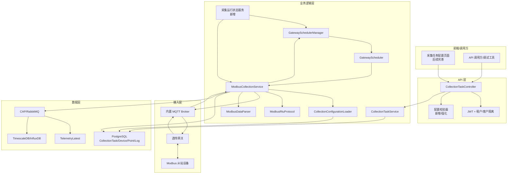

# 实施计划：透传网关 Modbus 采集模块

## Goal

本计划基于同目录 `prd.md`，用于把现有透传网关 Modbus 采集模块从“第一版可运行实现”推进到“可交付、可诊断、可持续扩展”的状态。当前仓库已经具备实体、API、后台服务、调度器、组帧解析和采集日志，不需要推倒重写。实施重点是补齐配置校验、运行诊断、转换规则、调度生命周期、协议文档和测试覆盖。

## Requirements

- 保留现有 `CollectionTask`、`CollectionDevice`、`CollectionPoint`、`CollectionLog` 模型。
- 保留现有 `CollectionTaskController` 和 `CollectionTaskService` 主入口。
- 保留现有 `ModbusCollectionService`、`GatewaySchedulerManager`、`GatewayScheduler`、`ModbusRtuProtocol`、`ModbusDataParser`。
- 补齐采集任务校验，不允许明显错误配置进入运行时。
- 补齐运行状态查询，暴露调度器状态、待响应请求数量、最近错误和最近采集时间。
- 完善 Modbus 数据解析和转换规则，尤其是 `WordOrder` 和多寄存器类型。
- 强化采集日志查询和错误诊断。
- 增加单元测试和必要的服务级测试。
- 遵循统一 API 返回：`ApiResult<T>`，查询结果使用 `{ total, rows }`。

## Technical Considerations

### System Architecture Overview



### Technology Stack Selection

- 后端：继续使用 .NET 10 / ASP.NET Core。
- API：继续使用 MVC Controller，不引入 tRPC 或额外 API 框架。
- 后台任务：继续使用 `BackgroundService` 承载采集运行时。
- MQTT：继续使用 MQTTnet 内置 Broker 和现有 Topic 模型。
- 数据库：继续使用 PostgreSQL 和 EF Core。
- 遥测链路：继续通过 `IPublisher.PublishTelemetryData` 写入现有最新值和历史数据链路。
- 测试：优先使用当前解决方案已有测试项目；若新增测试，放在 `IoTSharp.Test` 或按现有测试约定扩展。

### Integration Points

- `GatewayDeviceId` 必须引用 `DeviceType.Gateway`。
- 采集成功后通过 `IPublisher` 发布遥测，不直接绕过现有数据链路写表。
- MQTT 请求 Topic：`gateway/{gatewayName}/modbus/request/{requestId}`。
- MQTT 响应 Topic：`gateway/{gatewayName}/modbus/response/{requestId}`。
- 网关在线状态复用 `AttributeLatest` 中 `_Active` 和 `_LastActivityDateTime`。

### Deployment Architecture

第一阶段不新增独立服务。`ModbusCollectionService` 随 `IoTSharp` 主应用启动，依赖 PostgreSQL、RabbitMQ 和 MQTT Broker。多实例部署时暂定只允许一个实例启用采集运行时，后续如需横向扩展，再引入分布式锁或独立采集服务。

### Scalability Considerations

- 按网关拆分调度器，避免一个网关阻塞全部采集。
- 按点位轮询周期分队列，降低高频点与低频点互相影响。
- 对 pending request 设置上限，避免网关异常时内存堆积。
- 采集日志需要后续归档或清理策略，避免表无限增长。
- 多实例场景需要防止重复采集。

## Database Schema Design

```mermaid
erDiagram
    Device ||--o{ CollectionTask : "GatewayDeviceId"
    CollectionTask ||--o{ CollectionDevice : "TaskId"
    CollectionDevice ||--o{ CollectionPoint : "DeviceId"
    Device ||--o{ CollectionPoint : "TargetDeviceId"
    CollectionTask ||--o{ CollectionLog : "TaskId"
    CollectionDevice ||--o{ CollectionLog : "DeviceId"
    CollectionPoint ||--o{ CollectionLog : "PointId"

    CollectionTask {
        Guid Id
        string TaskKey
        Guid GatewayDeviceId
        string Protocol
        int Version
        bool Enabled
        string ConnectionJson
        string ReportPolicyJson
        DateTime CreatedAt
        DateTime UpdatedAt
    }

    CollectionDevice {
        Guid Id
        Guid TaskId
        string DeviceKey
        string DeviceName
        byte SlaveId
        bool Enabled
        int SortOrder
        string ProtocolOptionsJson
        DateTime CreatedAt
        DateTime UpdatedAt
    }

    CollectionPoint {
        Guid Id
        Guid DeviceId
        string PointKey
        string PointName
        byte FunctionCode
        ushort Address
        ushort RegisterCount
        string RawDataType
        string ByteOrder
        string WordOrder
        int ReadPeriodMs
        string PollingGroup
        string TransformsJson
        Guid TargetDeviceId
        string TargetName
        string TargetType
        string TargetValueType
        string DisplayName
        string Unit
        string GroupName
        bool Enabled
        int SortOrder
    }

    CollectionLog {
        Guid Id
        Guid GatewayDeviceId
        Guid TaskId
        Guid DeviceId
        Guid PointId
        string RequestId
        DateTime RequestAt
        string RequestFrame
        DateTime ResponseAt
        string ResponseFrame
        string ParsedValue
        string ConvertedValue
        string Status
        string ErrorMessage
        int DurationMs
        DateTime CreatedAt
    }
```



### Table Specifications

- `CollectionTask.TaskKey`：业务唯一标识，需唯一约束或服务层强校验。
- `CollectionTask.GatewayDeviceId`：必须指向网关设备。
- `CollectionDevice.SlaveId`：范围 `1-247`。
- `CollectionPoint.FunctionCode`：范围 `1/2/3/4`。
- `CollectionPoint.Address`：Modbus 起始地址，当前按 0 基地址处理。
- `CollectionPoint.RegisterCount`：必须与 `RawDataType` 匹配。
- `CollectionPoint.TargetDeviceId`、`TargetName`：遥测写入时必须存在。
- `CollectionLog.Status`：建议限定为 `Success/Timeout/CrcError/NoResponse/ParseError/ExceptionResponse` 等枚举字符串。

### Indexing Strategy

- `CollectionTask(TaskKey)`：唯一索引。
- `CollectionTask(GatewayDeviceId, Enabled)`：加载启用任务。
- `CollectionDevice(TaskId, SlaveId)`：按任务加载从站。
- `CollectionPoint(DeviceId, Enabled)`：按从站加载启用点位。
- `CollectionLog(GatewayDeviceId, CreatedAt)`：网关日志查询。
- `CollectionLog(TaskId, CreatedAt)`：任务日志查询。
- `CollectionLog(PointId, CreatedAt)`：点位故障排查。
- `CollectionLog(Status, CreatedAt)`：按状态过滤。

### Migration Strategy

当前实体已存在。实施时先检查数据库迁移是否已覆盖所有字段和索引；若新增索引、状态字段或运行诊断字段，必须生成 EF Core migration。修改实体、DTO、枚举或 Job/HostedService 构造函数后，必须执行完整 `dotnet clean` 和 `dotnet build`，不能只依赖热重载。

## API Design

### Existing Endpoints

- `GET /api/CollectionTask/GetAll`
- `GET /api/CollectionTask/Get/{id}`
- `POST /api/CollectionTask/Create`
- `PUT /api/CollectionTask/Update/{id}`
- `DELETE /api/CollectionTask/Delete/{id}`
- `POST /api/CollectionTask/Enable/{id}/Enable`
- `POST /api/CollectionTask/Disable/{id}/Disable`
- `GET /api/CollectionTask/GetLogs`
- `GET /api/CollectionTask/GetDraft`
- `POST /api/CollectionTask/ValidateDraft`
- `POST /api/CollectionTask/Preview`

### New or Enhanced Endpoints

- `GET /api/CollectionTask/GetRuntimeStatus`
  - 返回所有网关调度器状态、待响应请求数量、最近执行时间、最近错误。
- `GET /api/CollectionTask/GetRuntimeStatus/{gatewayDeviceId}`
  - 返回单个网关采集状态。
- `POST /api/CollectionTask/Validate`
  - 对完整任务做运行前校验，比草稿校验更严格。
- `POST /api/CollectionTask/TestPoint`
  - 可选，针对单点生成请求并等待一次响应，用于现场调试。

### Response Shape

查询类接口统一：

```json
{
  "code": 0,
  "msg": "OK",
  "data": {
    "total": 1,
    "rows": []
  }
}
```

新增/更新后返回实体也使用：

```json
{
  "code": 0,
  "msg": "OK",
  "data": {
    "total": 1,
    "rows": [{ }]
  }
}
```

### Error Handling

- 配置错误：返回 `ApiCode.InValidData`，并给出字段级错误消息。
- 任务不存在：返回 `ApiCode.NotFoundDevice` 或后续专用错误码。
- 网关不是 `DeviceType.Gateway`：返回配置错误。
- 网关离线：运行时跳过发送，并记录状态，不作为 API 创建失败。
- MQTT 发布异常：记录 `CollectionLog` 或运行状态错误。

## Implementation Steps

### Step 1：协议和配置文档补齐

- 新增 `docs/ways-of-work/plan/hvac-cloud-platform/transparent-modbus-collection/protocol.md`。
- 明确 Topic、Payload、Hex 大小写、requestId、QoS、超时和网关响应格式。
- 明确 Modbus 地址采用 0 基还是 1 基展示，避免现场配置误差。

### Step 2：配置校验服务

- 新增或强化 `CollectionTaskValidator`。
- 校验 TaskKey、GatewayDeviceId、Protocol、SlaveId、FunctionCode、Address、RegisterCount、RawDataType、ByteOrder、WordOrder、ReadPeriodMs、TargetName。
- 校验 `GatewayDeviceId` 对应设备必须是网关。
- 校验 `RawDataType` 与 `RegisterCount` 的最小长度匹配。
- Controller 在 Create/Update/Validate 中统一调用。

### Step 3：解析和转换规则强化

- 扩展 `ModbusDataParser`，完整应用 `WordOrder`。
- 补齐 `int16/uint16/int32/uint32/float32/float64/bool/string` 的解析测试。
- 支持常见转换规则：Scale、Offset、Round、EnumMap、BooleanMap。
- 转换失败时记录 `ParseError`，不得写入遥测。

### Step 4：调度生命周期修正

- 检查 `GatewaySchedulerManager.StartAllAsync()` 当前是否会被长期运行的调度器阻塞。
- 将每个调度器作为后台任务启动并跟踪，而不是在启动阶段等待所有调度器结束。
- 配置刷新时避免重复订阅 `OnBatchReadyAsync`。
- 配置更新时确保旧调度器取消，新调度器启动。

### Step 5：运行状态查询

- 在 `ModbusCollectionService` 或独立状态服务中暴露：
  - 总 pending request 数。
  - 按网关 pending request 数。
  - 调度器运行状态。
  - 最近请求时间。
  - 最近成功时间。
  - 最近错误。
- 在 `CollectionTaskController` 增加运行状态查询接口。

### Step 6：日志查询增强

- `GetLogs` 增加 `taskId`、`deviceId`、`pointId` 过滤。
- 返回 DTO，避免直接暴露实体导航或无关字段。
- 日志列表继续使用 `{ total, rows }`。
- 可选增加最近失败摘要接口。

### Step 7：测试覆盖

- `ModbusRtuProtocol`：组帧、CRC、异常响应解析。
- `ModbusDataParser`：数据类型、字节序、字顺序、转换规则。
- `CollectionTaskValidator`：合法配置和非法配置。
- `GatewayScheduler`：点位到期判断和批次合并。
- `ModbusCollectionService`：成功响应、未知 requestId、超时、解析失败。

### Step 8：构建验证

- 执行 `dotnet clean`。
- 执行 `dotnet build IoTSharp.sln`。
- 如测试项目可用，执行相关测试。
- 若修改 DTO、枚举、公共接口或 HostedService 构造函数，必须停止运行进程后全量构建。

## Frontend Architecture

本计划不实现完整前端页面，但为后续前端预留接口：

- 采集任务列表。
- 采集任务编辑。
- 点位表格导入/导出。
- 点位预览和单点测试。
- 采集日志列表。
- 网关运行状态面板。

前端应使用现有 `ClientApp` 技术栈，不在本模块引入新的前端架构。

## Security Performance

- 所有管理 API 必须 `[Authorize]`。
- 查询和修改采集任务必须进行租户/客户归属过滤。
- 采集任务只能绑定当前租户/客户下的网关。
- 目标设备必须属于同一租户/客户，避免采集值写入其他租户设备。
- MQTT Payload 必须限制大小，避免异常大报文影响服务。
- pending request 需要设置上限和超时清理。
- 单个网关异常不得影响其他网关调度。
- 采集日志需要后续保留周期配置。

## Risks

- 当前调度器生命周期可能存在启动阻塞或重复订阅风险，需要优先验证。
- 透传网关实际 MQTT Payload 格式可能因厂商配置不同而变化，需要协议文档和适配层。
- Modbus 地址 0 基/1 基容易造成现场误配置，需要 UI 和文档明确。
- 多实例部署会导致重复采集，第一阶段应明确单实例采集约束。
- 高频采集点过多可能造成 MQTT、网关串口和数据库压力，需要限制最小轮询周期。

## Definition of Done

- PRD 中 P0/P1 需求均有对应实现或明确保留说明。
- 配置校验覆盖主要错误场景。
- 成功采集可写入目标设备遥测。
- 超时、CRC 错误、解析失败均能记录日志。
- 运行状态接口可查看调度器和 pending 请求状态。
- 核心协议、解析、校验和调度逻辑有测试覆盖。
- `dotnet clean` 与 `dotnet build IoTSharp.sln` 通过。

